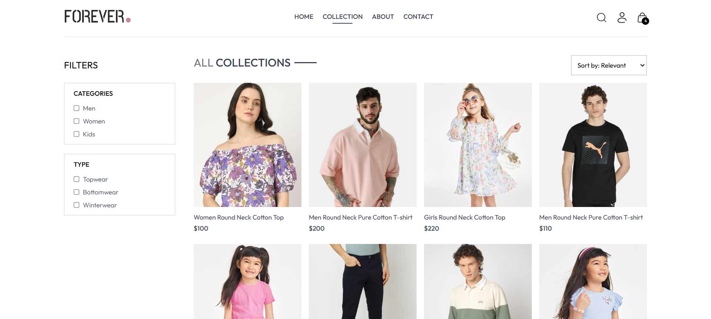
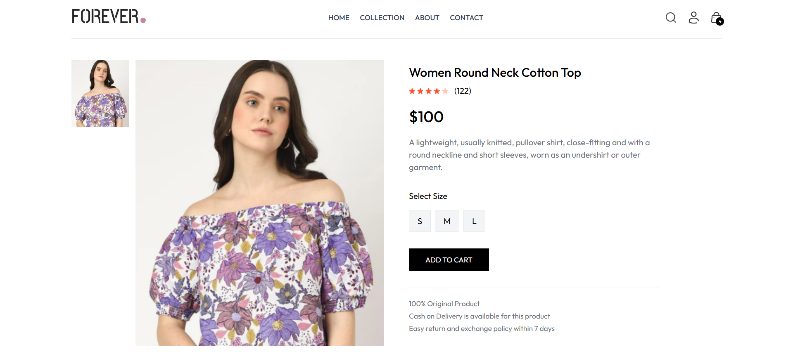
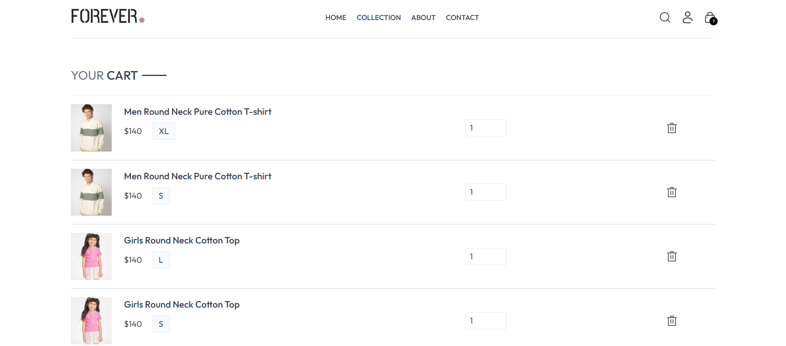
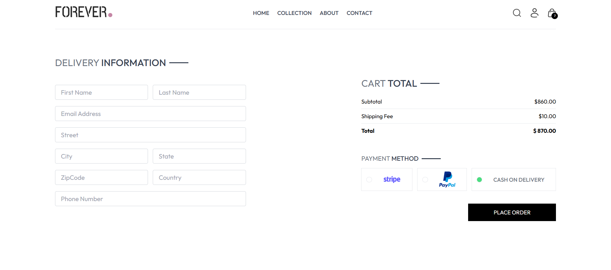
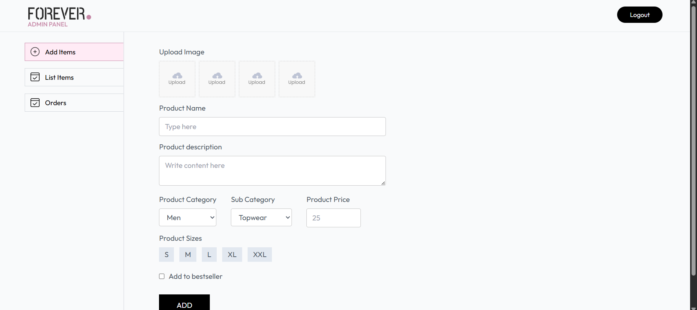

# 🛒 Online Store (MERN Stack)

A full-stack e-commerce web application built using the MERN stack. It features secure authentication, product browsing, cart management, and a complete order workflow with an admin dashboard.

---

## 🌐 Live Demo

👉 https://forever-frontend-seven-pi.vercel.app/

---

## 📸 Screenshots

### 🏠 Homepage


### 📦 Browse Products


### 🛍️ Product Details


### 🛒 Cart


### 📦 Checkout


### ⚙️ Admin Panel


---

## ✨ Features

- 🔐 Secure authentication using JWT  
- 🛍️ Product browsing and detailed product views  
- 🛒 Shopping cart with persistent state  
- 📦 Complete order placement workflow  
- ⚙️ Admin panel for managing products and orders  
- ☁️ Image uploads via Cloudinary  
- ⚡ Optimized backend with MongoDB and Mongoose  
- 📱 Fully responsive UI  

---

## 🧱 Tech Stack

- Frontend: React
- Backend: node.js + express.js 
- Database: mongoDB 
- Authentication: JWT  
- Image Storage: Cloudinary  

---

## ⚙️ Installation & Setup

```bash
# Clone the repository
git clone https://github.com/apokalypc/Full_Stack_E-Commerce_Website.git

# Backend setup
cd backend
npm install
npm run dev

# Frontend setup
cd frontend
npm install
npm run dev

```

## 🔐 Environment Variables

Create a `.env` file in the backend:

```env
MONGO_URI=your_mongodb_connection_string  
JWT_SECRET=your_secret_key  
CLOUDINARY_NAME=your_cloud_name  
CLOUDINARY_API_KEY=your_api_key  
CLOUDINARY_API_SECRET=your_api_secret

 ```
## 🚀 Deployment

- Frontend: Vercel
- Backend: Vercel
- Database: MongoDB Atlas

## 🧠 What I Learned

- Building a full-stack MERN application  
- Designing and consuming RESTful APIs  
- Implementing secure authentication and authorization  
- Managing state and user interactions  
- Deploying a production-ready application  

## 👨‍💻 Author

- Trevor Ewart
- GitHub: https://github.com/apokalypc
- LinkedIn: https://linkedin.com/in/trevorewart
